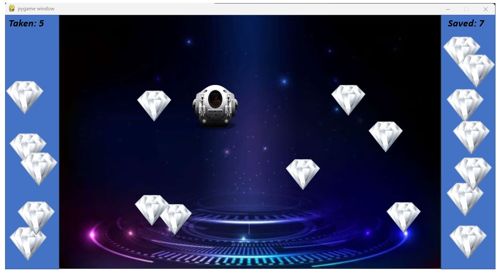

## SaveTheDaimonds
- The spaceship would bounce on the edges of the central area (the area surrounded by the panels)
- When the spaceship collects a diamond, it is moved to the **Taken** panel and the count, and the count increases there.
- When the user clicks on a diamond, it is moved to the **Saved** panel, and the count increases there.
- Use the provided CoffeeHealing font for the added text.
- Use sprite groups for the two added panels

## Mockup

